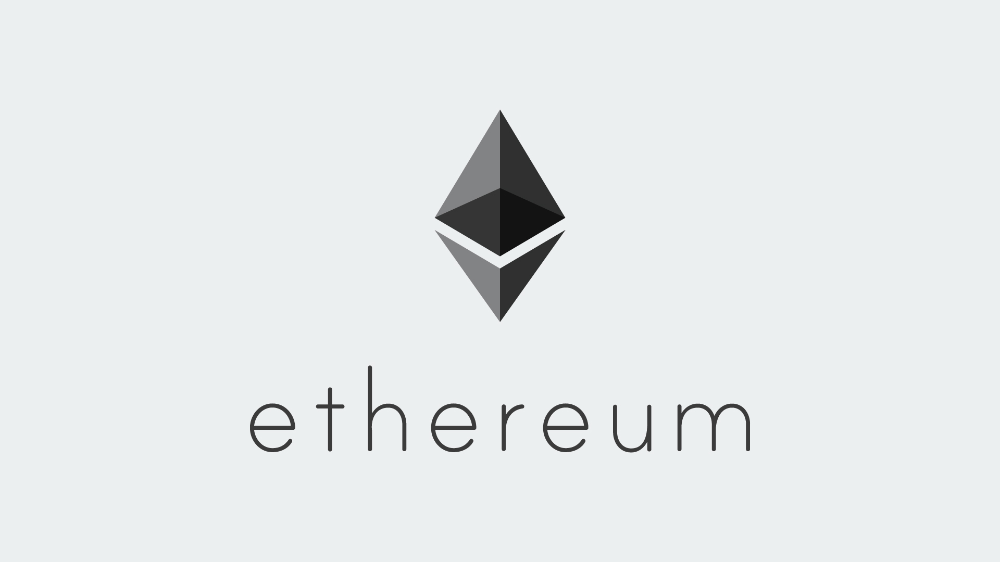

# NFTService for Rock`n`Block


NFT Service is a backend applications designed for seamless interaction with ERC-721.\
The service provides REST APIs for UNIT operations, including querying total supply, creating unique tokens, and retrieving token lists.
It integrates with smart contracts to execute blockchain transactions and stores token metadata in a PostgreSQL.

[Swagger docs](http://127.0.0.1:8008/api/docs/swagger/index.html)

## Installed Packages
- [Go-Ethereum](https://github.com/ethereum/go-ethereum)
- [GIN Web Framework](https://github.com/gin-gonic/gin)
- [PGXPool for PostgreSQL](https://github.com/jackc/pgx)
- [Go-Swagger3](https://github.com/parvez3019/go-swagger3)
- [Go-Migrate](https://github.com/golang-migrate/migrate)

## Prerequisites
Step 1: Clone repository
```bash
mkdir nft_service &&
cd nft_service &&
git clone https://github.com/paxyside/NFTService.git
```

Step 2: Environment Configuration
```bash
cp .env.example .env && chmod 600 .env
```

Step 3: Create Docker Network (First Time Only)
```bash
docker network create ntf_network
```

## Start application using Docker Compose
```bash
docker compose build && docker compose up -d
```

## Start application using Makefile
Step 1: Start database container
```bash
docker compose up database -d
```
Step 2: Start application
```bash
make pack && make run
```

## Useful Commands

### To view logs use
```bash
docker compose logs --tail 100
```

### To update swagger docs use
```bash
rm -f ./docs/swagger.json &&
go-swagger3 --module-path . --main-file-path ./cmd/nft_service/main.go --output ./docs/swagger.json --schema-without-pkg
```


## Project structure
```bash
.
├── cmd/
│   └── nft_service/                 # Main entry point for the application
├── docs/
│   └── swagger.json                 # Swagger API documentation
├── infrastructure/
│   ├── config/                      # Application configuration
│   ├── database/                    # Database connection and setup
│   └── utils/                       # Utility functions (e.g., hash generation, test helpers)
├── internal/
│   ├── application/                 # Main application logic (e.g., server setup)
│   ├── contract/                    # Contract service for interacting with the blockchain
│   ├── controller/                  # HTTP handlers and middleware
│   ├── domain/                      # Domain models and business logic
│   ├── persistence/                 # Database repository implementations
│   └── service/                     # Service layer for token management
├── migrations/                      # Database migration files
│   ├── 000001_base_schema.up.sql    # Initial schema setup
│   └── 000001_base_schema.down.sql  # Rollback for the initial schema
├── contract_abi.json                # ABI for interacting with the NFT smart contract
├── docker-compose.yaml              # Docker Compose configuration
├── Dockerfile                       # Dockerfile for building the application
├── Makefile                         # Build and run commands for the project
├── go.mod                           # Go dependencies
├── go.sum                           # Go dependency checksums
├── img.png                          # Project illustration
└── README.md                        # Documentation for the project
```
